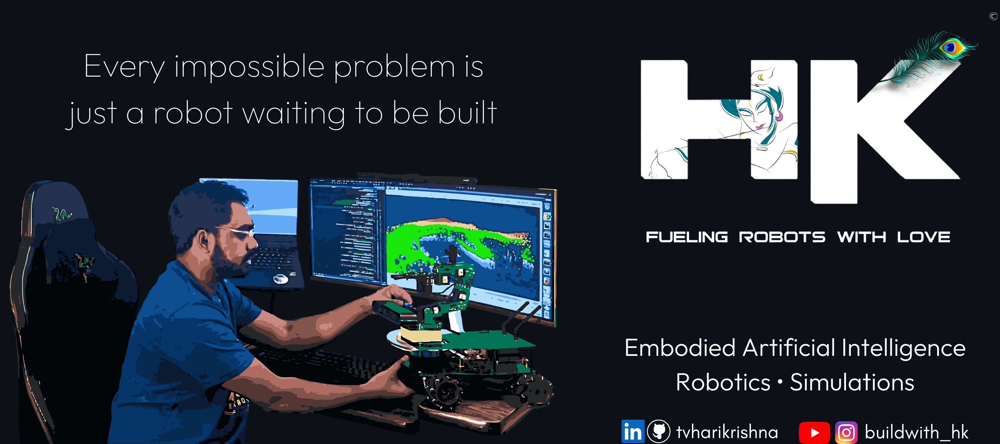

  

Passion for solving real-world problems through robotics and AI, building and deploying systems end to end. Turning ideas sketched on a whiteboard into prototypes, integrating and validating them until they operate as reliable, production-ready systems in real environments.

Love working in simulation and robotics system integration, creating physics-based models that capture real dynamics and enable smooth transition from virtual testing to physical deployment. Focus on bridging simulation and real hardware so systems behave consistently and predictably in production environments.

 

<td align="center">
  
</td>

  

<td align="center">
  
</td>

  

