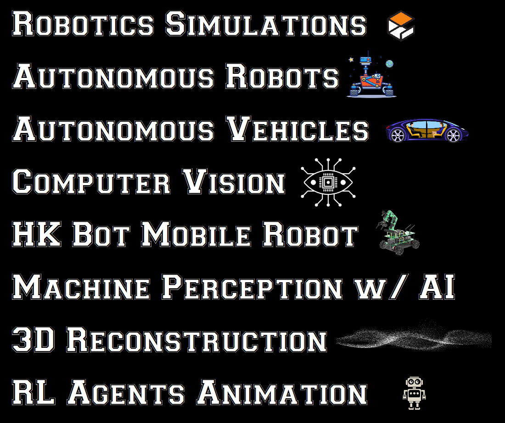
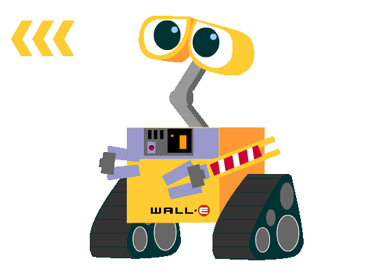
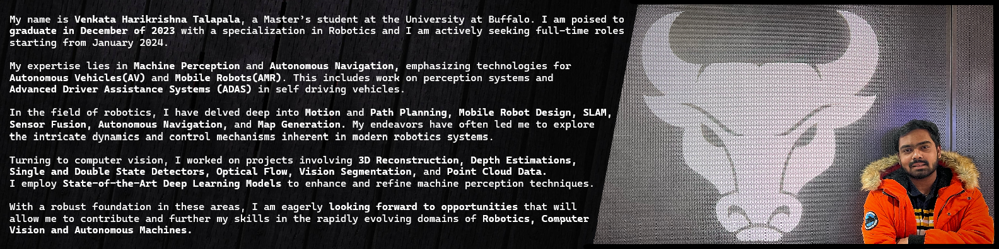

<h1 align="center">🤖 𝗛𝗲𝗹𝗹𝗼, 𝗥𝗼𝗯𝗼𝘁𝗶𝗰𝘀 𝗘𝗻𝘁𝗵𝘂𝘀𝗶𝗮𝘀𝘁𝘀! 𝗜'𝗺 𝗧 𝗩 𝗛𝗮𝗿𝗶 𝗞𝗿𝗶𝘀𝗵𝗻𝗮 (𝗛𝗞)</h1>

---

<h1 align="center"> 😀 𝑀𝓎 𝐹𝑜𝒸𝓊𝓈 𝒪𝓃 😀 </h1>

  
  

---

<h1 align="center">┏ What you'll find in my GitHub Account ┓</h1>
<h1 align="center"> 👁️ Machine Perception ☣ Autonomous Navigation 🎢</h1>

---

<h1 align="center">┏ Repository Naming Convention ┓</h1>

  

---

<h1 align="center">┏ Who I Am 👨‍💻 ┓</h1>

---

### Connect with me:

[LinkedIn](#) | [Personal Website](#)
