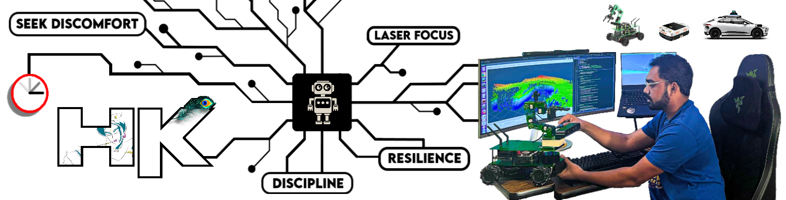
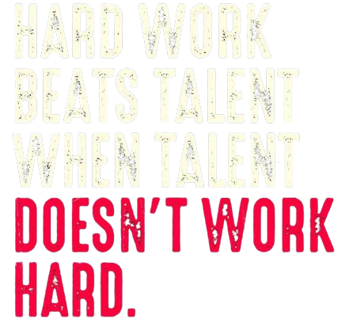
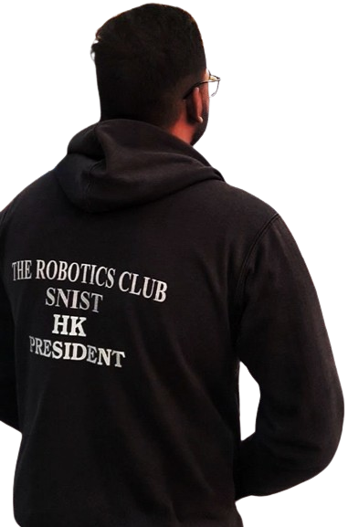
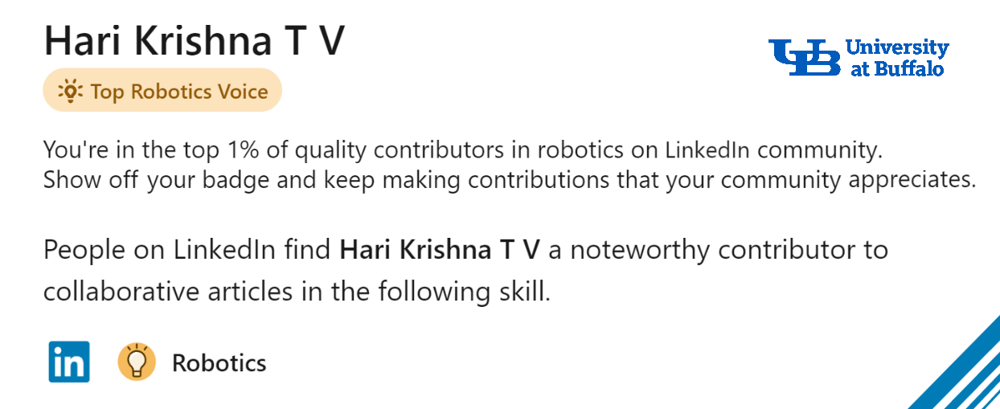
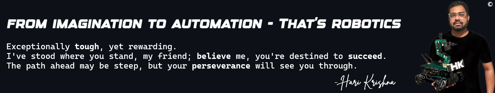

<!-- README: tvharikrishna-->

© 𝘁𝘃𝗵𝗮𝗿𝗶𝗸𝗿𝗶𝘀𝗵𝗻𝗮, 𝟮𝟬𝟮𝟰

<!-- Main Title Image -->

    

<!-- Cover Photo -->

    

 

<!-- Secondary Title Image -->

    

<!-- Table for Repository Details -->

    <table border="6" width="100%" style="border-collapse: collapse;">
        <tr>
            <th><b>Repo Prefix</b></th>
            <th><b>Repo Type / Project Type</b></th>
            <th><b>Number of Repos</b></th>
            <th><b>Frameworks/Tools</b></th>
        </tr>
        <tr>
            <td><a href="https://github.com/tvharikrishna/HariKrishna__Wheeled_Mobile_Robots"><b>Wheeled_Mobile_Robots</b></a></td>
            <td>AMR</td>
            <td align="center">6</td>
            <td align="right">HK-BOT, Nvidia Isaac, Gazebo</td>
        </tr>
        <tr>
            <td><a href="https://github.com/tvharikrishna/HariKrishna__Autonomous_Vehicles"><b>Autonomous_Vehicles</b></a></td>
            <td>Self Driving Vehicles</td>
            <td align="center">2</td>
            <td align="right">Carla, Apollo</td>
        </tr>
        <tr>
            <td><a href="https://github.com/tvharikrishna/HariKrishna__Motion_Planning"><b>Motion_Planning</b></a></td>
            <td>Path & Motion Algorithms</td>
            <td align="center">2</td>
            <td align="right">Nvidia Isaac, Gazebo, Path Animations</td>
        </tr>
        <tr>
            <td><a href="https://github.com/tvharikrishna/HariKrishna__3D_ComputerVision"><b>3D_Computer_Vision</b></a></td>
            <td>2D/3D Computer Vision</td>
            <td align="center">1</td>
            <td align="right">OpenCV</td>
        </tr>
        <tr>
            <td><a href="https://github.com/tvharikrishna/HariKrishna__AI_Vision"><b>AI_Vision</b></a></td>
            <td>Deep Learning Perception</td>
            <td align="center">0</td>
            <td align="right">Keras, Pytorch, Tensorflow, ONNX</td>
        </tr>
        <tr>
            <td><a href="https://github.com/tvharikrishna/HariKrishna__Robotic_Arm_Manipulations"><b>Robotic_Arm_Manipulation</b></a></td>
            <td>Cobots & AMMR</td>
            <td align="center">1</td>
            <td align="right">HK-BOT, Nvidia Isaac</td>
        </tr>
        <tr>
            <td><a href="https://github.com/tvharikrishna/HariKrishna__Legged_Robots"><b>Legged_Robots</b></a></td>
            <td>Bi & Quadrupedal Robots</td>
            <td align="center">0</td>
            <td align="right">Nvidia Isaac, Bullet Physics, MuJuCo</td>
        </tr>
        <tr>
            <td><a href="https://github.com/tvharikrishna/HariKrishna__Reinforcement_Learning"><b>Reinforcement_Learning</b></a></td>
            <td>RL Agents</td>
            <td align="center">2</td>
            <td align="right">Nvidia Isaac Gym, Bullet Physics, MuJuCo</td>
        </tr>
    </table>

<!-- Repo Notice Image -->

    

 

<!-- Total Repositories Badge -->

  

 

<!-- Note Badge -->

  

<!-- Note Content -->

  Some of my repositories 𝗹𝗮𝗰𝗸 𝗰𝗼𝗱𝗲 because they are related to 𝗰𝗼𝘂𝗿𝘀𝗲𝘄𝗼𝗿𝗸 from SUNY Buffalo.  
  In compliance with the 𝗨𝗻𝗶𝘃𝗲𝗿𝘀𝗶𝘁𝘆 𝗮𝘁 𝗕𝘂𝗳𝗳𝗮𝗹𝗼'𝘀 𝗔𝗰𝗮𝗱𝗲𝗺𝗶𝗰 𝗜𝗻𝘁𝗲𝗴𝗿𝗶𝘁𝘆 𝗣𝗼𝗹𝗶𝗰𝘆, it is prohibited to upload code to any online platform.

--- 

<!-- Connect with Me Title -->

    

 

<!-- Social Links and Contact Information -->

   &nbsp; &nbsp; 
   &nbsp; &nbsp;
   &nbsp; &nbsp;
   &nbsp; &nbsp;

  

<!-- GitHub Status and Statistics -->

 <table>
  <tr>
   <td valign="top">
     
     
    

     
    

              
          
    
   </td>
   <td valign="top" align="center">
     
    

    
    

  </td>
  </tr>
 </table>

 
 
 
 

<!-- Final Image -->

    

