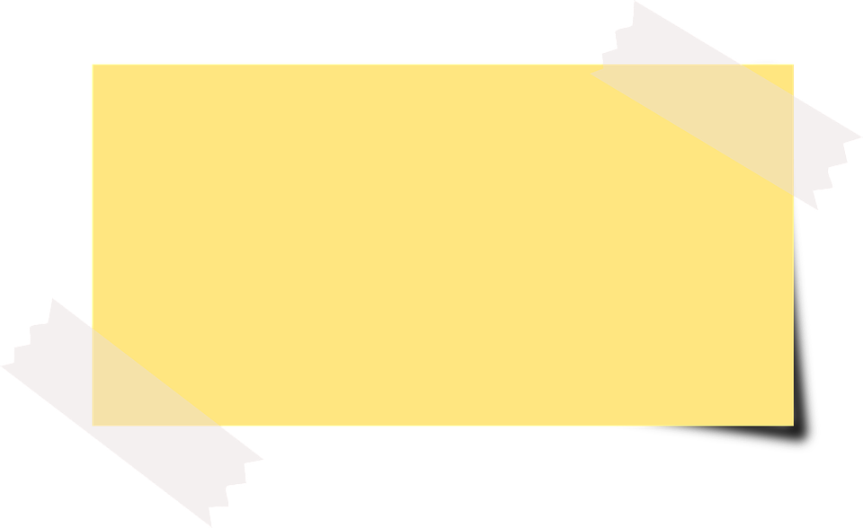
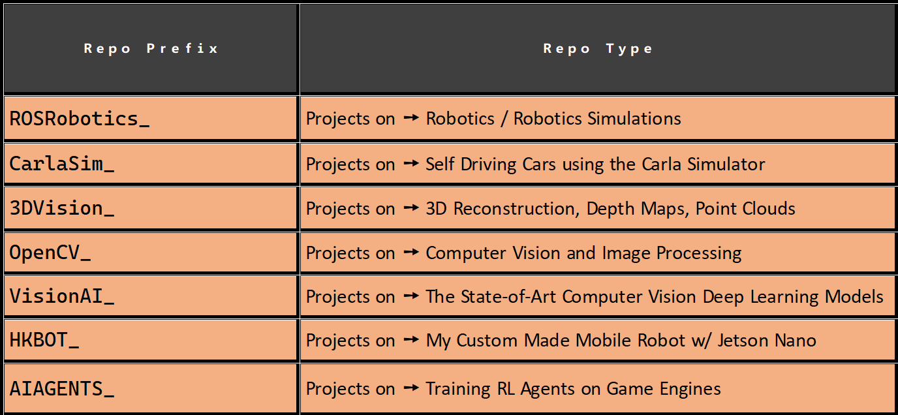

<h1 style="color: black;">🤖 𝗛𝗲𝗹𝗹𝗼, 𝗥𝗼𝗯𝗼𝘁𝗶𝗰𝘀 𝗘𝗻𝘁𝗵𝘂𝘀𝗶𝗮𝘀𝘁𝘀! 𝗜'𝗺 𝗧 𝗩 𝗛𝗮𝗿𝗶 𝗞𝗿𝗶𝘀𝗵𝗻𝗮 (𝗛𝗞)</h1>

<h1 align="center"> 😀 𝑀𝓎 𝐹𝑜𝒸𝓊𝓈 𝒪𝓃 😀 </h1>
                
    🤖 𝗥𝗼𝗯𝗼𝘁𝗶𝗰𝘀 𝗦𝗶𝗺𝘂𝗹𝗮𝘁𝗶𝗼𝗻𝘀           🚆 𝗔𝘂𝘁𝗼𝗻𝗼𝗺𝗼𝘂𝘀 𝗥𝗼𝗯𝗼𝘁𝘀             🚗 𝗔𝘂𝘁𝗼𝗻𝗼𝗺𝗼𝘂𝘀 𝗩𝗲𝗰𝗵𝗶𝗰𝗹𝗲𝘀           🚧 𝐂𝐨𝐦𝐩𝐮𝐭𝐞𝐫 𝐕𝐢𝐬𝐢𝐨𝐧 
    
          🌜𝐇𝐊_𝐁𝐨𝐭                🧠 𝐌𝐚𝐜𝐡𝐢𝐧𝐞 𝐕𝐢𝐬𝐢𝐨𝐧 𝐰/ 𝐀𝐈            🗾 𝟑𝐃 𝐑𝐞𝐜𝐨𝐧𝐬𝐭𝐫𝐮𝐜𝐭𝐢𝐨𝐧           🛩️ 𝐑𝐋 𝐀𝐠𝐞𝐧𝐭𝐬 𝐀𝐧𝐢𝐦𝐚𝐭𝐢𝐨𝐧

          
<h1 align="center">┏ About Me- Image here ┓</h1>

<h1 align="center">┏ What You'll Find in This GitHub Account ┓</h1>

<h1 align="center"> 👁️ Machine Perception ☣ Autonomous Navigation 🎢</h1>

<h1 align="center">┏ Repository Naming Convention ┓</h1>

  

Feel free to explore these repositories for a glimpse into my work and interests in robotics and AI. Each project reflects my dedication and enthusiasm in this field.

_Happy coding!_ 🚀🤖

---

### Connect with me:

[LinkedIn](#) | [Personal Website](#)
