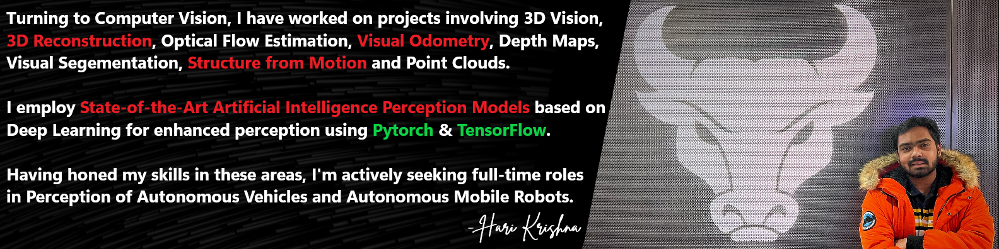

 

<!------------------------------ MAIN ------------------------------------------>

  The chart organizes my <strong>main repositories</strong> and their <strong>submodules</strong>, each focusing on <strong>domain-specific work</strong>.

  <table align="center">
    <tr>
      <th>Repo Prefix</th>
      <th align="center">Repo Emoji</th>
      <th align="center">Number of Repo</th>
    </tr>
    <tr>
      <td align="left">_ROSRobotics</td>
      <td align="center">☢️</td>
      <td align="center">0</td>
    </tr>
    <tr>
      <td align="left">_SelfDrivingCars</td>
      <td align="center">🚗</td>
      <td align="center">0</td>
    </tr>
    <tr>
      <td align="left">_AIVision</td>
      <td align="center">🧠</td>
      <td align="center">0</td>
    </tr>
    <tr></tr>
      <td align="left">_HKBOT_MobileRobot</td>
      <td align="center">🤖</td>
      <td align="center">0</td>
    </tr>
    <tr>
      <td align="left">_Motion_Planning</td>
      <td align="center">🚗 🪱</td>
      <td align="center">2</td>
    </tr>
    <tr>
      <td align="left">_3DVision</td>
      <td align="center">🗾</td>
      <td align="center">0</td>
    </tr>
    <tr>
      <td align="left">_ComputerVision</td>
      <td align="center">👀</td>
      <td align="center">0</td>
    </tr>
  </table>

 

  

 

  

  Some of my repositories 𝗹𝗮𝗰𝗸 𝗰𝗼𝗱𝗲 because they are related to 𝗰𝗼𝘂𝗿𝘀𝗲𝘄𝗼𝗿𝗸 from SUNY Buffalo.  
  In compliance with the 𝗨𝗻𝗶𝘃𝗲𝗿𝘀𝗶𝘁𝘆 𝗮𝘁 𝗕𝘂𝗳𝗳𝗮𝗹𝗼'𝘀 𝗔𝗰𝗮𝗱𝗲𝗺𝗶𝗰 𝗜𝗻𝘁𝗲𝗴𝗿𝗶𝘁𝘆 𝗣𝗼𝗹𝗶𝗰𝘆, it is prohibited to upload code to any online platform.

 

---

--- 

<h3 style="font-size: 28px;">
  <strong>Operating Systems & Shell Scripting</strong> <i class="fas fa-terminal" style="font-size: 24px;"></i>
</h3>

&nbsp;

&nbsp;

&nbsp;

&nbsp;

&nbsp;

&nbsp;

<h3 style="font-size: 28px;">
  <strong>Programming Languages</strong> <i class="fas fa-code" style="font-size: 24px;"></i>
</h3>

&nbsp;

<h3 style="font-size: 28px;">
  <strong>Libraries</strong> <i class="fas fa-book" style="font-size: 24px;"></i>
</h3>

&nbsp;

&nbsp;

&nbsp;

&nbsp;

&nbsp;

&nbsp;

&nbsp;

&nbsp;

&nbsp;

&nbsp;

&nbsp;

&nbsp;

&nbsp;

&nbsp;

<h3 style="font-size: 28px;">
  <strong>Tools</strong> <i class="fas fa-tools" style="font-size: 24px;"></i>
</h3>

&nbsp;
 
&nbsp;
 
&nbsp;

&nbsp;

&nbsp;

&nbsp;

&nbsp;

&nbsp;

&nbsp;

<h3 style="font-size: 28px;">
  <strong>Containerization and Version Control Tools</strong> <i class="fab fa-docker" style="font-size: 24px;"></i> <i class="fas fa-code-branch" style="font-size: 24px;"></i>
</h3>

&nbsp;

&nbsp;

--- 

    

    <a href="https://www.acsu.buffalo.edu/~talapala/"> <!-- Title 7 -->
         
    </a>
    
    
    

    
---

    

    
<table>
  <tr>
    <td></td>
    <td></td>
  </tr>
  <tr>
    <td></td>
    <td></td>
  </tr>
</table>

<table align="center">
  <tr>

  <td></td>

  <td></td>
  </tr>
</table>

  

    
<b>'HK' logo is Copyrighted & Protected by Department for Promotion of Industry & Internal Trade under the Govt of India's Intellectual Property Rights. I reserve the right to take legal action & file a lawsuit against any infringement on all social media platforms.</b>

    
<b> © All Rights Reserved to the Creator of Logo </b>

