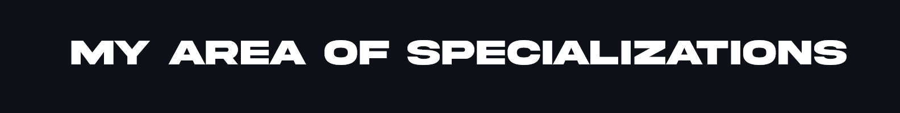
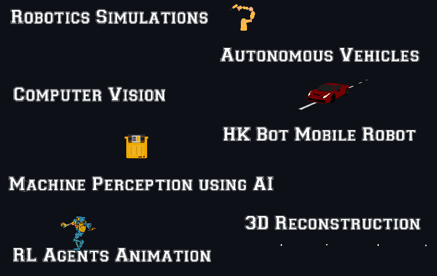
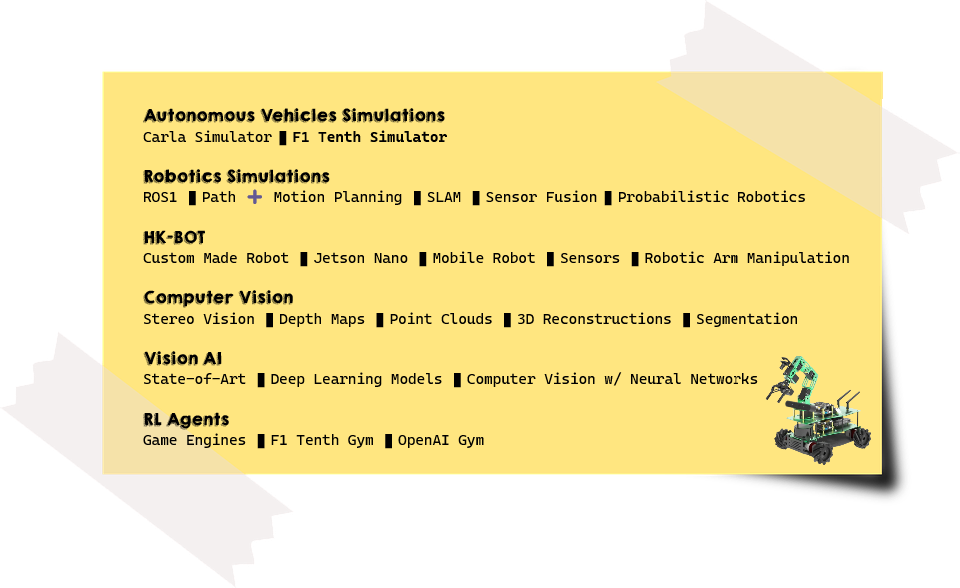
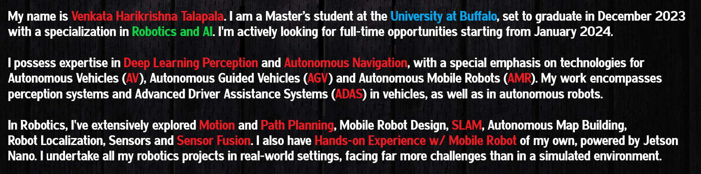
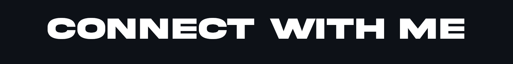
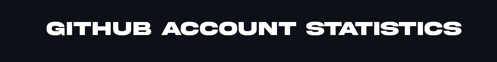
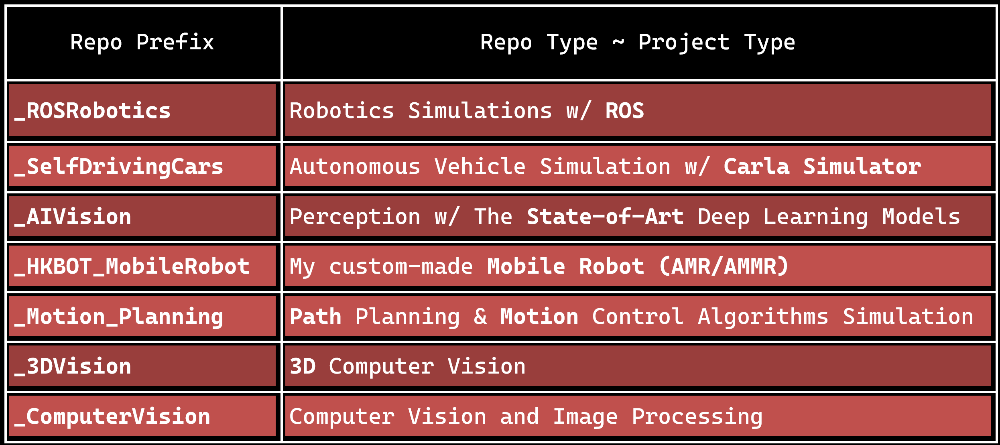

'𝗛𝗞' 𝗹𝗼𝗴𝗼 is 𝗰𝗼𝗽𝘆𝗿𝗶𝗴𝗵𝘁𝗲𝗱 and 𝗽𝗿𝗼𝘁𝗲𝗰𝘁𝗲𝗱 by the 𝗗𝗲𝗽𝗮𝗿𝘁𝗺𝗲𝗻𝘁 for 𝗣𝗿𝗼𝗺𝗼𝘁𝗶𝗼𝗻 𝗼𝗳 𝗜𝗻𝗱𝘂𝘀𝘁𝗿𝘆 and 𝗜𝗻𝘁𝗲𝗿𝗻𝗮𝗹 𝗧𝗿𝗮𝗱𝗲 𝘂𝗻𝗱𝗲𝗿 the 𝗚𝗼𝘃𝗲𝗿𝗻𝗺𝗲𝗻𝘁 𝗼𝗳 𝗜𝗻𝗱𝗶𝗮'𝘀 𝗜𝗻𝘁𝗲𝗹𝗹𝗲𝗰𝘁𝘂𝗮𝗹 𝗣𝗿𝗼𝗽𝗲𝗿𝘁𝘆 𝗜𝗻𝗱𝗶𝗮. I reserves the right to 𝘁𝗮𝗸𝗲 𝗹𝗲𝗴𝗮𝗹 𝗮𝗰𝘁𝗶𝗼𝗻 & 𝗳𝗶𝗹𝗲 𝗹𝗮𝘄𝘀𝘂𝗶𝘁 𝗮𝗴𝗮𝗶𝗻𝘀𝘁 𝗮𝗻𝘆 𝗶𝗻𝗳𝗿𝗶𝗻𝗴𝗲𝗺𝗲𝗻𝘁 on all social media platforms.

    <b>⚠️ 𝗔𝗹𝗹 𝗿𝗶𝗴𝗵𝘁𝘀 𝗮𝗿𝗲 𝗿𝗲𝘀𝗲𝗿𝘃𝗲𝗱 to the creater for logo ⚠️</b>

--- 

---

    

  

---

---

---

<!-- Technology and Tools Badges -->

  

<!-- Office Tools Badges -->

  

<!-- Other Tools Badges -->

---

<!-- Title 7 -->

    

    
    
    

<!-- Profile Views and Followers -->
<!-- Discord Animation GIF -->
---

    

<table>
  <tr>
    <td></td>
    <td></td>
  </tr>
  <tr>
    <td></td>
    <td></td>
  </tr>
</table>

<!-- GitHub Status - 1. GitHub Status 2.GitHub Streak 3.Github Repo Language Status -->
----

<table width="100%">
  <tr>
    <td align="center" width="50%">
      
    </td>
    <td align="center" width="50%">
      
    </td>
  </tr>
</table>

<!-- 3.Github Repo Language Status -->

  

---

<!-- Change Repo Count Here -->

  

 

