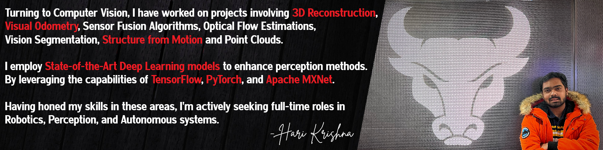

---

---

  
  

---

<h1 align="center">┏ What you'll find in my GitHub Account ┓</h1>
<h1 align="center"> 👁️ Machine Perception ☣ Autonomous Navigation 🎢</h1>

---

<h1 align="center">┏ Repository Naming Convention ┓</h1>

  

---

<h1 align="center">┏ Who I Am 👨‍💻 ┓</h1>

---

### Connect with me:

[LinkedIn](#) | [Personal Website](#)
