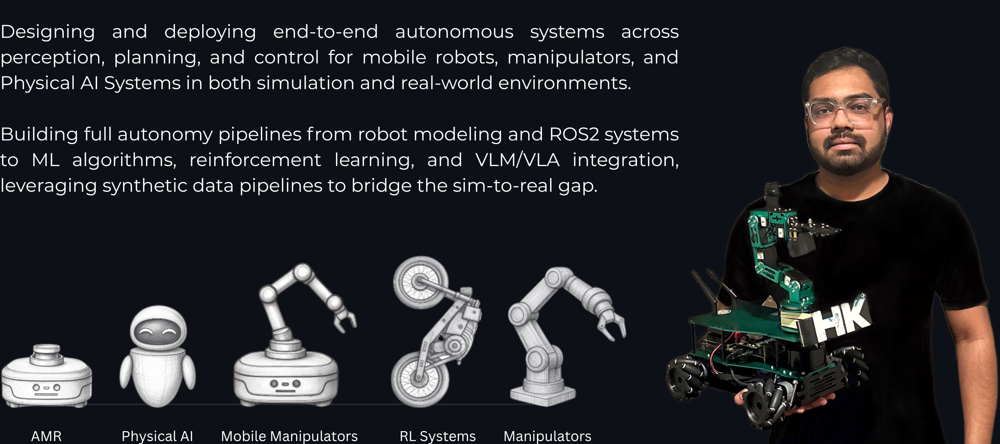
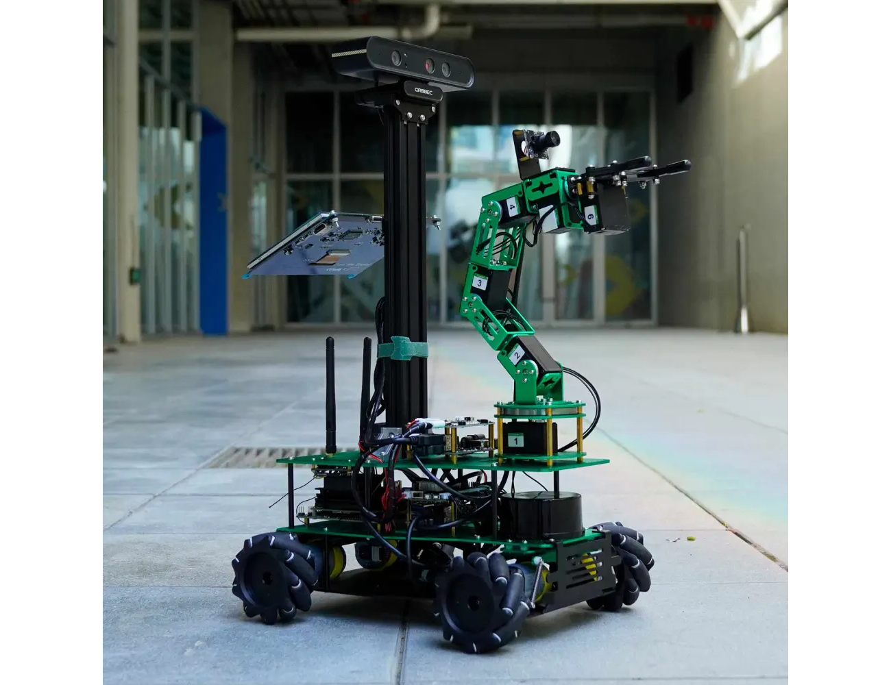
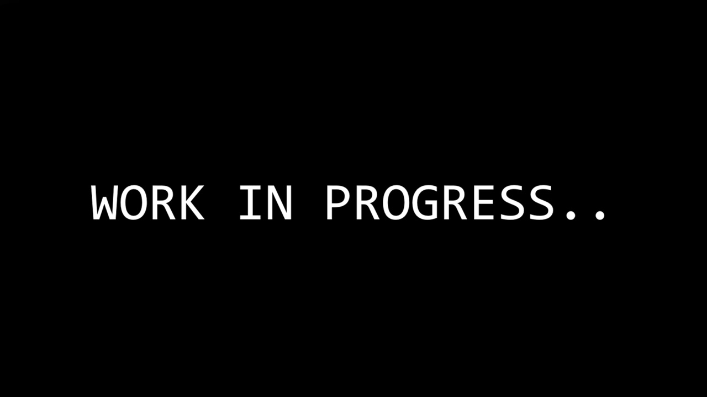
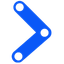
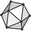
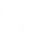
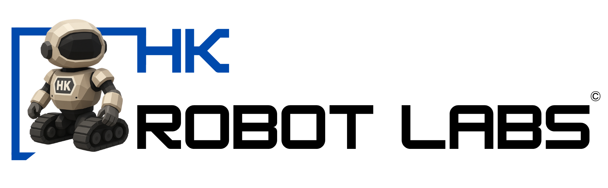
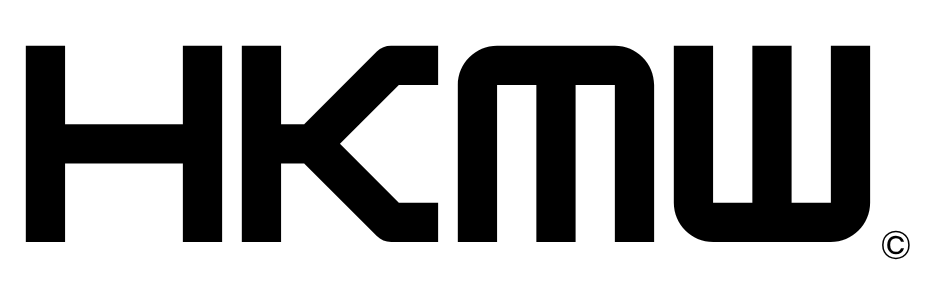

<!-- HEADER -->
 

<table width="100%" style="border:1px solid #444; border-radius:8px;">
<tr>
<td align="center" style="padding:0;">

</td>
</tr>
</table>

<!-- MY ROBOT -->
 

<table width="100%" style="table-layout:fixed;">
<tr><th align="center" width="58%"><strong>Autonomous Mobile Manipulation Robot</strong></th><th align="center" width="17%"><strong>Component</strong></th><th align="center" width="25%"><strong>Specification</strong></th></tr>
<tr><td align="center" rowspan="10" style="padding:0;"></td><td align="left"><strong>🧠 AI Board</strong></td><td align="right"><a href="https://www.nvidia.com/en-us/autonomous-machines/embedded-systems/jetson-orin/nano-super-developer-kit/">NVIDIA Jetson Orin Nano</a></td></tr>
<tr><td align="left"><strong>⚙️ MCU</strong></td><td align="right"><a href="https://category.yahboom.net/collections/ros-controller/products/ros-driver-board">STM32 Expansion Board</a></td></tr>
<tr><td align="left"><strong>🔧 Motors</strong></td><td align="right"><a href="https://category.yahboom.net/products/md520">205 RPM Motor w/ Encoder</a></td></tr>
<tr><td align="left"><strong>🛞 Drive Type</strong></td><td align="right"><a href="https://category.yahboom.net/products/wheel-set?variant=44767050629436">97 mm Mecanum</a></td></tr>
<tr><td align="left"><strong>🦾 Robotic Arm</strong></td><td align="right"><a href="https://category.yahboom.net/products/dofbot-jetson_nano">6-Axis DOFBOT</a></td></tr>
<tr><td align="left"><strong>📡 LiDAR</strong></td><td align="right"><a href="https://category.yahboom.net/products/ydlidar-4ros">YDLIDAR 4ROS</a></td></tr>
<tr><td align="left"><strong>📷 Depth Camera</strong></td><td align="right"><a href="https://www.orbbec.com/products/structured-light-camera/astra-series/">ORBBEC Astra Pro</a></td></tr>
<tr><td align="left"><strong>📐 IMU</strong></td><td align="right"><a href="https://category.yahboom.net/collections/ros-controller/products/ros-driver-board">9-Axis MPU9250</a></td></tr>
<tr><td align="left"><strong>🔗 Middleware</strong></td><td align="right"><a href="https://docs.ros.org/en/jazzy/index.html">ROS2 Jazzy</a></td></tr>
<tr><td align="left"><strong>💻 OS</strong></td><td align="right"><a href="https://releases.ubuntu.com/noble/">Ubuntu 24.04</a></td></tr>
</table>

<!-- PROJECTS -->
 

<table width="100%" style="table-layout:fixed; border-collapse:collapse;">
<tr>
<td align="center">  <strong>Project 1</strong></td>
<td align="center">  <strong>Project 2</strong></td>
<td align="center">  <strong>Project 3</strong></td>
</tr>
</table>

<!-- SIMULATION ASSETS -->
 

<table width="100%" style="table-layout:fixed; border-collapse:collapse;">
<tr>
<td align="center">  <strong>Asset 1</strong></td>
<td align="center">  <strong>Asset 2</strong></td>
<td align="center">  <strong>Asset 3</strong></td>
</tr>
</table>

<!-- TOOLS -->
 

<table align="center" style="table-layout:fixed; border-collapse:collapse; background:none;">
<tr>
<td align="center"> Linux</td>
<td align="center"> Python</td>
<td align="center"> C++</td>
<td align="center"> Java</td>
<td align="center"> ROS2</td>
<td align="center"> OpenRMF</td>
<td align="center"> Jetson</td>
<td align="center"> TensorFlow</td>
<td align="center"> PyTorch</td>
</tr>
<tr>
<td align="center"> Gazebo</td>
<td align="center"> Isaac Sim</td>
<td align="center"> Nav2</td>
<td align="center"> MoveIt2</td>
<td align="center"> OpenCV</td>
<td align="center"> PCL</td>
<td align="center"> CUDA</td>
<td align="center"> ONNX</td>
<td align="center"> TensorRT</td>
</tr>
<tr>
<td align="center"> Docker</td>
<td align="center"> Git</td>
<td align="center"> RabbitMQ</td>
<td align="center"> Prometheus</td>
<td align="center"> Grafana</td>
<td align="center"> VLM/VLA</td>
<td align="center"> LLM</td>
<td align="center"> Bash</td>
<td align="center"> Blender</td>
</tr>
</table>

<!-- HK ROBOT LABS | HK MOTION WORKS -->
<table width="100%" style="table-layout:fixed; border-collapse:collapse;">
<tr>
<td align="left" width="50%"><h1>HK Robot Labs</h1>Software, Robotics & Simulations</td>
<td align="left" width="50%"><h1>HK Motion Works</h1>3D Design & Simulation Assets</td>
</tr>
<tr>
<td align="left"></td>
<td align="left"></td>
</tr>
</table>

<!-- CONTACT -->
 

<table align="left" style="border-collapse:collapse;">
<tr>
<td align="center"></td>
<td align="center"></td>
<td align="center"></td>
<td align="left" style="padding-left:25px;">
Hey! Feel free to reach out for robotics, AI, projects, collaboration, guidance, or job opportunities.
</td>
</tr>

<tr>
<td align="center"><strong>tvharikrishna</strong></td>
<td align="center"><strong>@hkrobotlabs_official</strong></td>
<td align="center"><strong>@hkrobotlabs_official</strong></td>
<td align="left"><strong>📧 tvharikrishna08@gmail.com</strong></td>
</tr>
</table>